# On Demand SDN Slices in ComNetsEmu
Project for the course "Softwarized and Virtualized Mobile Networks" at the University of Trento

**Samuel Casagrande Cecchin** - [s.casagrande.cecchin@studenti.unitn.it](s.casagrande.cecchin@studenti.unitn.it)

**Davide De Martini** - [davide.demartini@studenti.unitn.it](davide.demartini@studenti.unitn.it)

**Stefano Sacchet** - [stefano.sacchet@studenti.unitn.it](stefano.sacchet@studenti.unitn.it)

## Table of Contents
- [On Demand SDN Slices in ComNetsEmu](#on-demand-sdn-slices-in-comnetsemu)
  - [Table of Contents](#table-of-contents)
  - [Requirements](#requirements)
  - [Project description](#project-description)
  - [Access web application outside vagrant](#access-web-application-outside-vagrant)
  - [Project structure](#project-structure)
  - [Introduction](#introduction)
    - [How to run the project](#how-to-run-the-project)
    - [Default Scenario](#default-scenario)
    - [Bottom Critical Scenario](#bottom-critical-scenario)
    - [Upper Critical Scenario](#upper-critical-scenario)
    - [Full Critical Scenario](#full-critical-scenario)
  - [Web App fuctionalities](#web-app-fuctionalities)
  - [Testing the network](#testing-the-network)
  - [Known Issues](#known-issues)

## Requirements
- Vagrant
- VirtualBox
- NodeJS
- NPM
- Python3
- Mininet
- Ryu
- ComNetsEmu

## Project description
**GOAL:** to implement a network slicing approach to enable dynamic activation/de-activation of network slices via GUI commands.

We will use the ComNetsEmu framework to implement the network and Ryu as a SDN controller.

## Project Layout
```
├── [OnDemandSlicing]
|    ├── [html]
|    ├── [sh_scripts]
|    |    ├── bothCritical.sh
|    |    ├── default.sh
|    |    ├── lowerCritical.sh
|    |    ├── reset.sh
|    |    └── upperCritical.sh
|    ├── controller.py
|    ├── gui_start.py
|    ├── launcher.sh
|    └── topology.py
├── [images]
|    ├── [Iperf]
|    ├── [Pingall]
|    ├── [Scenarios]
|    └── [webapp]
└── [webApp]
     ├── [public]
     │    ├── [images]
     │    ├── home.html
     │    ├── homeStyle.css
     │    ├── index.html
     │    ├── loginStyle.css
     │    ├── script.js
     │    ├── snake
     │    └── spaceGame
     ├── package.json      
     └── server.js

```

## Access web application outside vagrant
In order to have the web server running inside the vagrant machine we have to create a private network between the host machine and the vagrant machine. This is done by following the steps below:

1) Exit the vagrant machine
2) Add this line to the vagrant file 
   ```BASH
   config.vm.network "private_network", ip: "192.168.56.2"
   ```
3) Run `vagrant reload`
4) Run `vagrant ssh`
5) Now a new ip address is assigned to the vagrant machine, we will use it to access the web application from outside the vagrant machine

## Project structure
The project is structured as follows:
- Folder `OnDemandSlicing` contains the code of the ryu controller, the topology and the topology visualizer
- Folder `Web App` contains our web application that display the topology and allows the user to switch to the different scenarios.
## Introduction

### How to run the project
In order to run the project we have to follow these steps:
```BASH
cd ~/ProgettoNet2
vagrant up
vagrant ssh
```
Entered the vagrant machine we have to run the following commands (to install all packages needed for the web app):
```BASH
cd ~/ProgettoNet2/webApp
npm install
```
Than to run the web app:
```BASH
node server.js
```
Once the web app is running we can open a browser and go to the following address to access the web app:
```BASH
http://192.168.56.2:8081
```

<!-- Entered the vagrant machine we have to run the following commands (for the mininet simulation):
```BASH
cd OnDemandSlicing
sudo python3 topology.py
```
In another window we have to run the following commands (for the controller):
```BASH
cd ~/ProgettoNet2
vagrant ssh
cd OnDemandSlicing
ryu-manager --observe-links gui_start.py controller.py
```
In another window we have to run the following commands (for the web app):
```BASH
cd ~/ProgettoNet2
vagrant ssh
cd WebApp
sudo apt install nodejs
sudo apt install npm
npm install
node server.js
``` -->

### Default Scenario

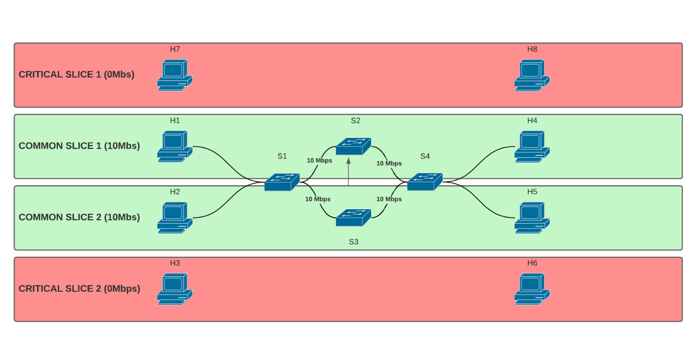

In our default scenario there are 4 hosts and 4 switches, two slices
- Upper slice with H1 and H4 using a 10 Mbps link
- Bottom slice with H2 and H% using a 10 Mbps link

Host H3, H6, H7 and H8 are not part of any slice and aren't connected to any switch.

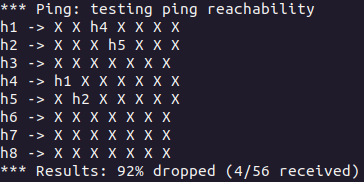\
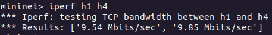\
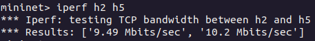

### Bottom Critical Scenario
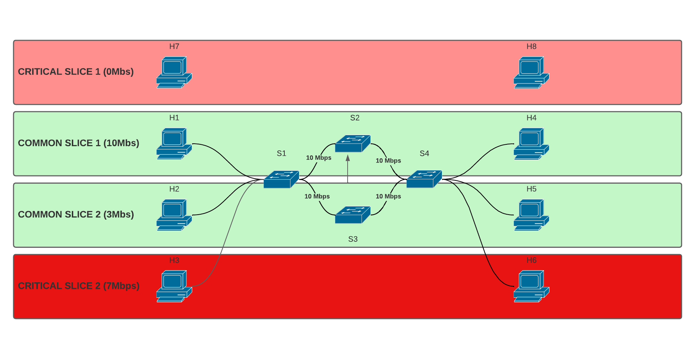

In our lower critical scenario there are 6 hosts and 4 switches, three slices
- Upper slice with H1 and H4 using a 10 Mbps link
- H2 and H5 slice with a 3 Mbps link
- H3 and H6 slice with a 7 Mbps link
Host H7 and H8 are not part of any slice and aren't connected to any switch.

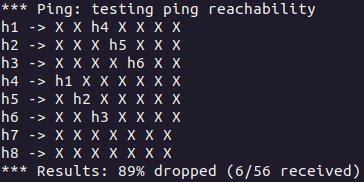\
\
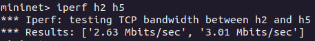\
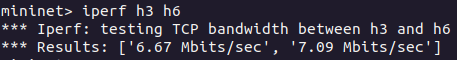

### Upper Critical Scenario
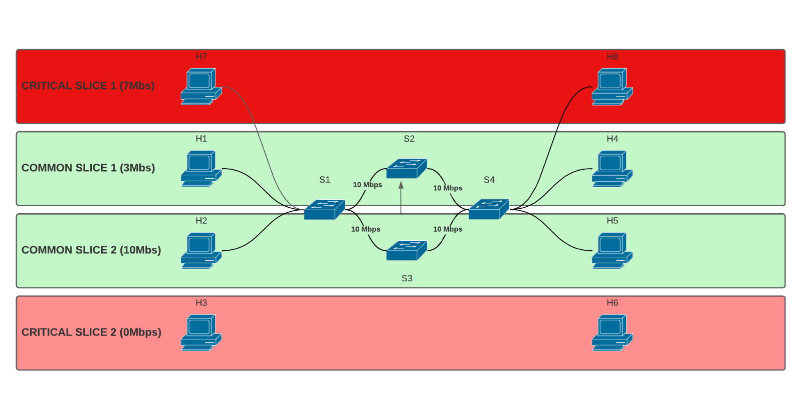

In our upper critical scenario there are 6 hosts and 4 switches, three slices
- H1 and H4 slice wirh a 3 Mbps link
- H7 and H8 slice with a 7 Mbps link
- Bottom slice with H2 and H5 using a 10 Mbps link
Host H3 and H6 are not part of any slice and aren't connected to any switch.

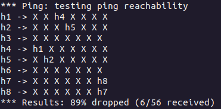\
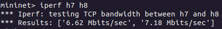\
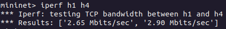\
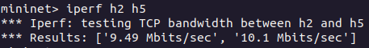

### Full Critical Scenario
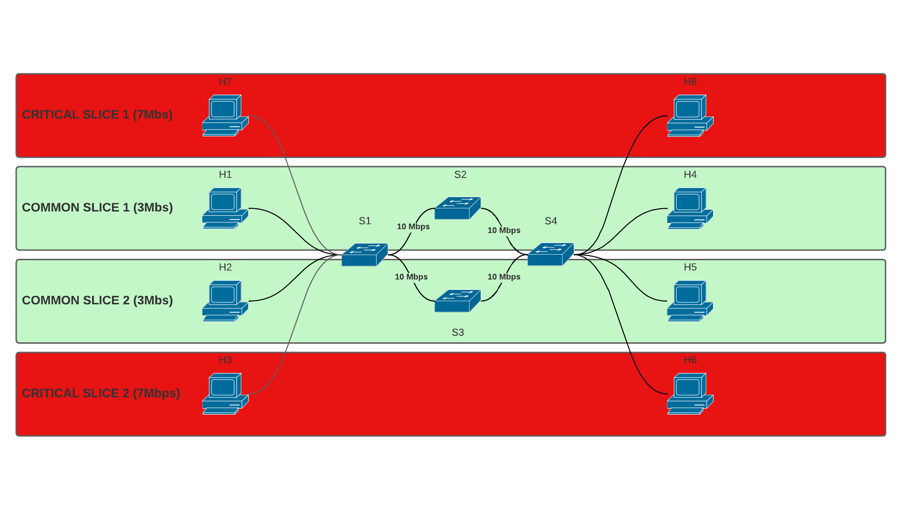

In our full critical scenario there are 8 hosts and 4 switches, four slices
- H1 and H4 slice wirh a 3 Mbps link
- H7 and H8 slice with a 7 Mbps link
- H2 and H5 slice with a 3 Mbps link
- H3 and H6 slice with a 7 Mbps link
All the hosts are connected.

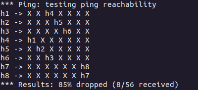\
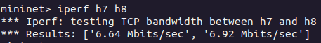\
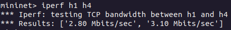\
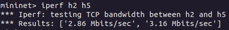\
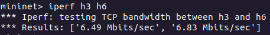

## Web App fuctionalities
Our Web App allows the user to switch between the different scenarios and see the topology of the network in real time. It requires at first a simple login with username and password: **admin**

Once the login has been performed, we are redirected to the control page, in this page we are able start the network, switch between the different scenarios and stop the network.

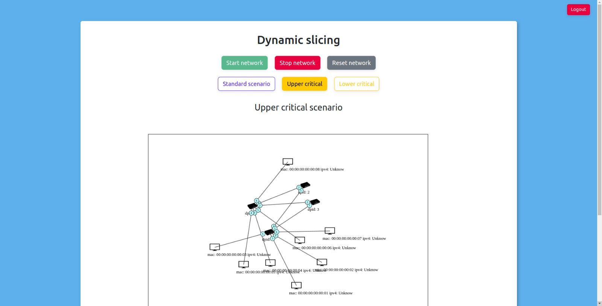

## Testing the network

For testing the network we can use the mininet console to ping the hosts and see if the network is working properly.
We can perform a ping in these two ways:
```
mininet> h1 ping h2
```
```
mininet> pingall
```
For testing the bandwidth we can use the iperf command:
```
mininet> h1 iperf h2
```
Of course h1 and h2 can be replaced with any other host in the network.

## Known Issues
When trowing a command that do not autoterminate (like h1 ping h2) the web app functionalities stop working. In order to have the webapp working you have to restart it.
