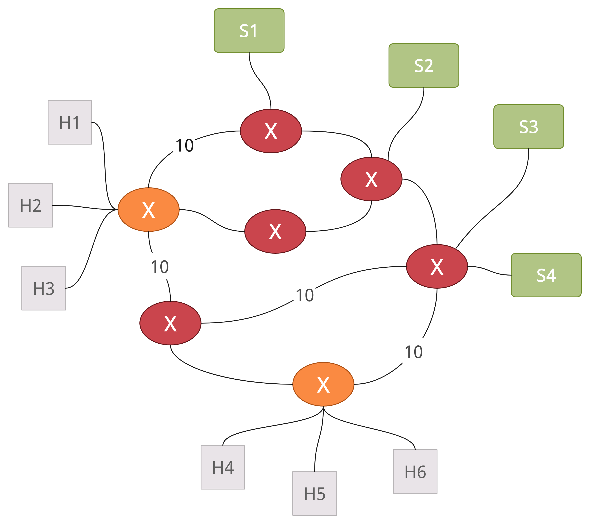

# Alcune idee per la topologia

## Categorie di slice
### Slice per servizi critici (ex. applicazioni di obotica)
- high latency
- survivability (deve continuare a funzionare anche se si verifcano eventi critici). Per garantirla si possono utilizzare più istanziazioni di RAN (ridondanza)
- high priority
### Slice per servizi latency-sensitive (ex. applicazioni di realtà aumentata e realtà virtuale, transmissione video). Ogni servizio dovrebbe continuare ad essere garantito anche durante un carico elevato sulla rete
- high latency
- low survivability
### Slice per servizi non-critici (ex. comune navigazione web)
### Slice per servizi di mobilità (ex. servizi di logistica)
- low-latency
- low delays
- high reliability
### Slice per altri tipi di servizi (ex. servizi a wide-area/limited-area)

## idea
- Si potrebbe costruire uno slice per servizi critici con più possibilità di essere raggiunto. Nel momento in cui un certo path non risulta essere più adatto (in termini capacità e latenza), si utilizza un altro path
- [...]

